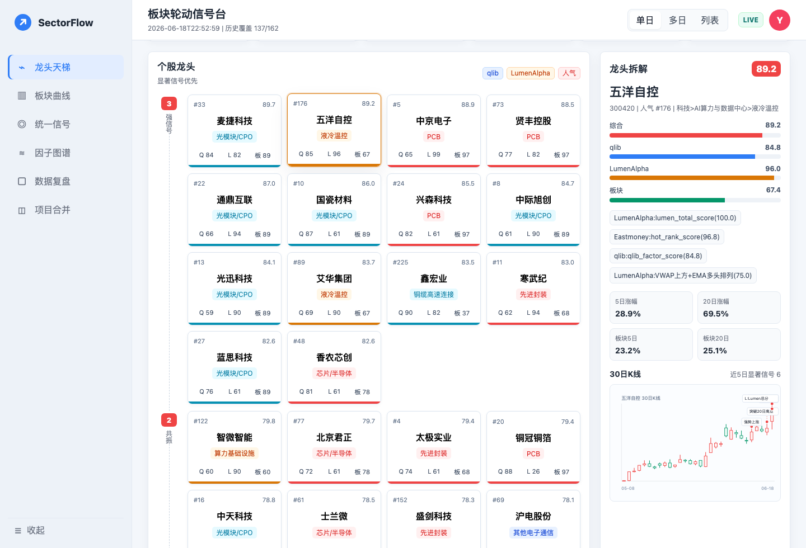
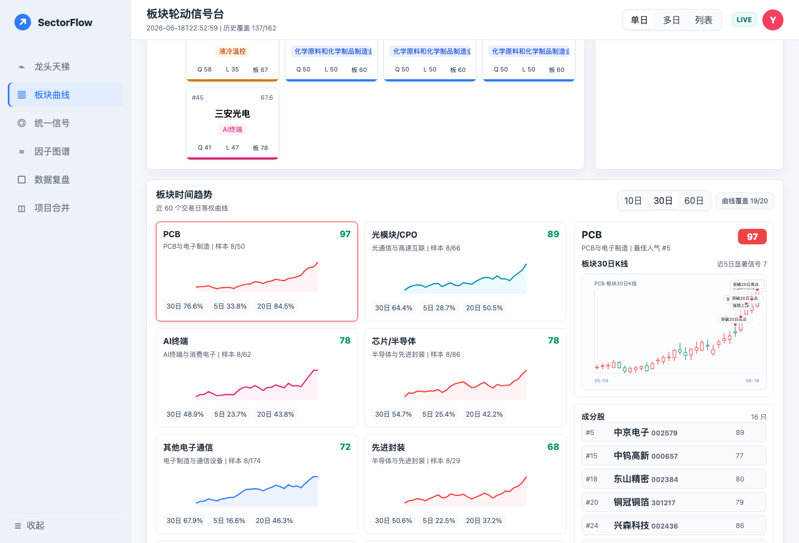
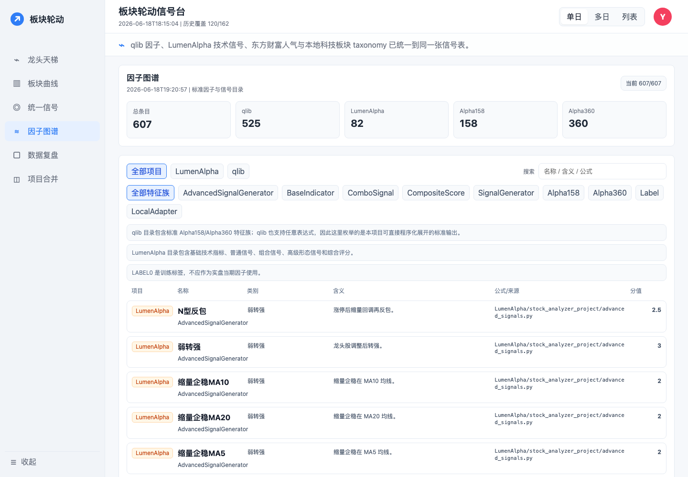
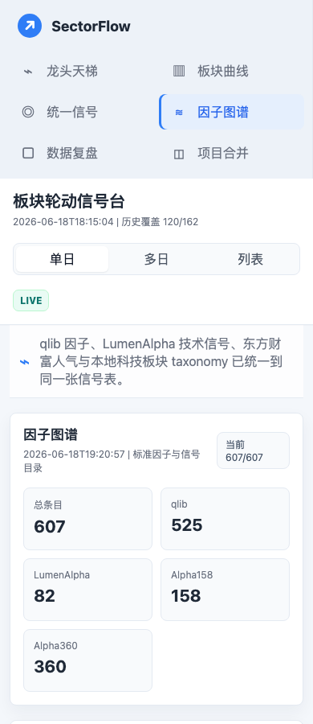

# LumenAlpha x qlib Sector Rotation v2

这是一个面向 A 股科技板块轮动的研究与可视化项目，把 `LumenAlpha` 的回测/报告信号、`microsoft/qlib` 的量化因子思路，以及 A 股人气榜与板块分层规则合并到一条统一信号流里。

v2 的重点是先把“能每天跑、能看懂、能点击追问”做成闭环：

- A 股人气榜前 2000 股票采集与科技细分板块重分类。
- qlib 风格因子与 LumenAlpha 风格信号统一打分，并保留 `source` 字段。
- 龙头天梯、板块曲线、统一信号、日报分析、因子图谱、数据复盘、项目合并等页面。
- 个股/板块点击后展示 30 日 K 线，并把最近 5 天显著信号直接标注在 K 线上。
- 可选 DeepSeek 实时分析入口，API key 只从本地环境变量读取，不写入仓库。

## Quick Start

```bash
cd web/sector_rotation_dashboard
npm start -- --port 8766
```

打开本地页面：

```text
http://127.0.0.1:8766/
```

启用 DeepSeek 实时分析：

```bash
DEEPSEEK_API_KEY=your_key npm start -- --port 8766
```

无 key 时页面仍可完整浏览，只是“AI 分析”按钮会提示需要配置环境变量。

## Daily Refresh

日常刷新推荐使用增量模式，复用板块映射、分类和历史 K 线缓存，降低接口调用与限流风险：

```bash
.venv-tests/bin/python scripts/daily_refresh_sector_rotation.py --mode daily
```

需要全量重建科技板块分类时使用 weekly：

```bash
.venv-tests/bin/python scripts/daily_refresh_sector_rotation.py --mode weekly
```

## Visual Pages

### 龙头天梯与 K 线信号

点击个股龙头后，右侧展示 30 日 K 线和最近 5 天显著信号。信号标记直接落在 K 线上，用来判断“强势是否仍在延续”。



### 板块轮动与成分股

板块页支持选择观察窗口，点击板块后展示成分股、板块合成 K 线和最近信号，用于比较 PCB、算力服务器、光模块/CPO、液冷温控等科技细分方向。



### 因子图谱

因子图谱页汇总 qlib 与 LumenAlpha 当前能输出的因子、信号来源和含义，便于后续筛选、去重和统一解释。



### 移动端检查

主要页面已做移动端布局检查，信息密度会下降但保留核心跳转与卡片交互。



## Project Layout

```text
LumenAlpha/                         # upstream submodule
microsoft-qlib/                     # upstream submodule
config/tech_board_taxonomy.json     # 科技板块分层规则
lumen_qlib/                         # 信号合并、因子目录、轮动 pipeline
scripts/                            # 采集、重分类、每日刷新、启动脚本
data/a_share_hot_rank/              # 最新人气榜与板块分类快照
data/sector_rotation/               # 最新统一信号、板块汇总、日报、因子目录
web/sector_rotation_dashboard/      # 静态可视化页面与本地 API server
```

## Notes

- `.venv-tests/`、`.test-home/`、历史 K 线缓存、每日运行日志和 AI 分析缓存不会提交到仓库。
- `LumenAlpha` 和 `microsoft-qlib` 以 submodule 固定版本引用，避免把上游仓库完整复制进当前项目。
- 当前页面主要用于研究与决策辅助，不构成投资建议。
